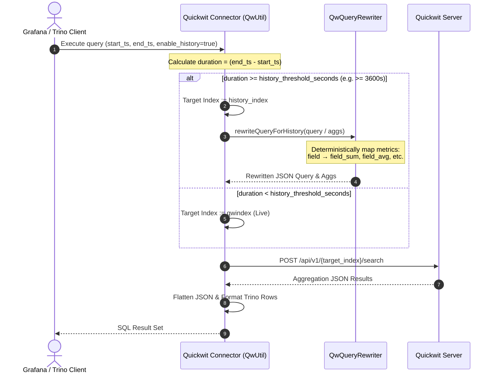

# Ulak Quickwit Connector for Trino

A Trino connector that exposes [Quickwit](https://quickwit.io) indices as queryable tables. It supports both raw document queries and aggregation-heavy analytics via a `raw_query` table function that flattens Quickwit's nested aggregation responses into SQL-accessible rows.

---

## Table of Contents

1. [Architecture](#architecture)
2. [Build & Deploy](#build--deploy)
3. [Table Query Mode](#table-query-mode)
4. [raw_query Table Function](#raw_query-table-function)
5. [Aggs DSL](#aggs-dsl)
6. [Column Naming](#column-naming)
7. [Schema Definition (`columns`)](#schema-definition-columns)
8. [SQL Patterns & Examples](#sql-patterns--examples)

---

## Architecture

```
Grafana / Trino SQL client
        │
        ▼
   Trino Engine
        │  TABLE(quickwit.system.raw_query(...))
        ▼
UlakQuickwitConnector
   ├── RawQuery.analyze()       — determines schema at plan time
   ├── QwUtil.select()          — executes HTTP request to Quickwit
   ├── arrangeAggregations()    — flattens nested agg JSON in-place
   ├── JFlat.json2Sheet()       — converts flat JSON to row/column table
   └── replacefromcolumns       — strips JFlat path prefixes → clean names
```

**Key design: aggregation flattening.** Quickwit returns nested aggregation buckets as deeply nested JSON. The connector walks this tree and embeds parent context (bucket keys) into each leaf metric node. JFlat then serialises the entire structure as a spreadsheet. The `replacefromcolumns` parameter strips the common JFlat path prefix, leaving clean short column names.

---

## Build & Deploy

```bash
# Build
./mvnw clean package

# Docker image (adjust registry as needed)
docker build -t <registry>/trinodb/trino:479 .
docker push <registry>/trinodb/trino:479
```

The plugin JAR is loaded by Trino from the `plugin/quickwit/` directory. The connector is configured in `etc/catalog/quickwit.properties`:

```properties
connector.name=quickwit
quickwit.url=http://quickwit-host:7280
quickwit.index=default-index
quickwit.connect-timeout=10000
quickwit.read-timeout=30000
```

---

## Table Query Mode

> **Not yet implemented.** Tracked as [J56 in TODO.md](TODO.md).

Planned: expose Quickwit index fields as a regular Trino table without embedded `//param` syntax:

```sql
-- DOES NOT WORK YET
SELECT host_uuid, src_ip, max_score
FROM quickwit.public."anomaly-flows"
WHERE alerted = 'true'
LIMIT 100
```

When implemented, schema will be inferred from the index's `DocMapping.fieldMappings` (all columns `VARCHAR`), and `WHERE` predicates will be pushed down as Quickwit query strings. Until then, use the [`raw_query` Table Function](#raw_query-table-function) for all queries.

---

## raw_query Table Function

The primary interface for analytics. Wraps a Quickwit search request (including aggregations) and returns results as a Trino table.

```sql
SELECT ...
FROM TABLE(
  quickwit.system.raw_query(
    "query"             => '<quickwit query string>',
    "qwindex"           => '<index name>',
    "start_timestamp"   => '<epoch seconds>',
    "end_timestamp"     => '<epoch seconds>',
    "max_hits"          => '0',            -- 0 = aggs only, no raw hits
    "aggs"              => '[...]',        -- Aggs DSL (see below)
    "columns"           => '<col1,col2,…>',-- fallback schema (see below)
    "replacefromcolumns"=> '<prefix>',     -- JFlat path prefix to strip
    "hasjs"             => 'true',         -- enable agg flattening
    "cache"             => 'false'
  )
) AS a
```

### Parameter reference

| Parameter | Default | Description |
|---|---|---|
| `query` | `*` | Quickwit query string (`field:value AND ...`) |
| `qwindex` | *(required)* | Quickwit index name (raw/live index) |
| `start_timestamp` | now−15m | Query start, epoch seconds |
| `end_timestamp` | now | Query end, epoch seconds |
| `max_hits` | `1000` | Max raw document hits; set to `0` for aggs-only |
| `aggs` | *(empty)* | Aggregations in Aggs DSL or raw Quickwit/ES JSON |
| `columns` | `no-data` | Comma-separated fallback column names (see [Schema Definition](#schema-definition-columns)) |
| `replacefromcolumns` | *(empty)* | JFlat path prefix stripped from all column names |
| `enable_history` | `false` | Dynamically route query to `history_index` if time range exceeds `history-time-threshold-seconds` |
| `history_index` | *(empty)* | Target rollup index name (e.g. `metrics3_15`, `rollup_15m_site_app`) |
| `hasjs` | `false` | Set `true` to enable aggregation tree flattening and JavaScript variable evaluation (`now`, `d`, `h`, `m`, `s`, `Math`) |
| `cache` | `false` | Enable Redis result caching |
| `sqlversion` | `0` | Aggregation response parsing mode (see below) |

---

## History & Rollup Query Routing

When `enable_history=true` is specified, the connector dynamically evaluates the query's time interval against the configured threshold (`history-time-threshold-seconds`, default 3600s).



### Metric Suffix Mapping Rules
1. All aggregation metrics inside the `aggs` block are deterministically rewritten to match rollup index schemas:
   * `"sum": {"field": "x"}` $\rightarrow$ `"field": "x_sum"`
   * `"avg": {"field": "x"}` $\rightarrow$ `"field": "x_avg"`
   * `"min": {"field": "x"}` $\rightarrow$ `"field": "x_min"`
   * `"max": {"field": "x"}` $\rightarrow$ `"field": "x_max"`
   * `"value_count": {"field": "x"}` $\rightarrow$ `"field": "x_count"`
2. Suffixes are idempotent; if a field already ends with `_sum`, `_avg`, etc., it is preserved as-is.
3. Flow metrics in `qw-rollup-engine` tasks are standardized to `_sum` (`u_sum`, `ac_sum`, `ab_sum`, `t_sum`, `u_ac_sum`, `t_ab_sum`), eliminating any need for hardcoded exceptions.

---

### `sqlversion` — aggregation parsing modes

Controls how Quickwit's nested aggregation JSON is converted to Trino rows. Only applies when `aggs` is non-empty.

| Value | Column name format | When to use |
|---|---|---|
| `0` (default) | JFlat path after `replacefromcolumns` stripping, e.g. `4/value`, `4/2/key` | Legacy queries; required when `replacefromcolumns` is set |
| `0.1` | `<aggId>/value`, `<aggId>/key` — recursive tree walk | New queries without `replacefromcolumns` |
| `0.2` | Bare `<aggId>` — same as `0.1` but `/value` and `/key` suffixes stripped | Cleanest column names; target for J47 migration |

> **Deprecation plan (J47):** `0` and `0.1` will be deprecated in favour of `0.2`. See `TODO.md`.

---

## Aggs DSL


A concise DSL for building Quickwit/Elasticsearch nested aggregations. The compiler (`AggsDslCompiler`) converts it to nested JSON automatically.

### Syntax

```
[
  histogram(field=<f>, interval=<i>, id=<n>, min=<m>),
  terms(field=<f>, size=<s>, id=<n>, min=<m>, order=id:<metric_id>:asc|desc),
  max(field=<f>, id=<n>),
  min(field=<f>, id=<n>),
  avg(field=<f>, id=<n>),
  sum(field=<f>, id=<n>),
  count(field=<f>, id=<n>)
]
```

### Nesting rules

The compiler always produces:

```
histogram → terms[0] → terms[1] → … → terms[N] → all metrics
```

Terms are nested **in declaration order**. All metric aggregations land at the **deepest level** (inside the last `terms`). This means each result row represents one unique combination of all bucket dimensions.

### Example

```sql
"aggs" => '[
  histogram(field=scored_at, interval=30s, id=1),
  terms(id=2, field=host_uuid),
  terms(id=3, field=src_ip),
  max(id=4, field=max_score),
  avg(id=5, field=avg_delay_ms)
]'
```

Produces the Quickwit JSON:

```json
{
  "1": {
    "date_histogram": { "field": "scored_at", "fixed_interval": "30s" },
    "aggs": {
      "2": {
        "terms": { "field": "host_uuid", "size": 10 },
        "aggs": {
          "3": {
            "terms": { "field": "src_ip", "size": 10 },
            "aggs": {
              "4": { "max": { "field": "max_score" } },
              "5": { "avg": { "field": "avg_delay_ms" } }
            }
          }
        }
      }
    }
  }
}
```

### IDs

- IDs are arbitrary integers; they become the column name prefix (see [Column Naming](#column-naming)).
- IDs must be unique across the entire DSL.
- If omitted, IDs are auto-assigned starting from 1 (avoiding conflicts).
- Grafana variables (`${interval}`, `${__interval_ms}ms`) are accepted in `interval` and `size` values.

### `order` on terms

```
terms(field=dst_ip, size=10, order=id:4:desc, id=3)
```

Orders buckets by the value of metric id=4. The referenced metric **must be declared** in the same DSL. The compiler injects a copy of the metric at the appropriate nesting level automatically.

---

## Column Naming

Understanding column names is essential for writing correct SQL.

### How flattening works

After `arrangeAggregations()` runs, each **leaf metric node** in the JSON tree has the **keys of all its ancestor bucket levels** embedded into it:

```
Before flattening — leaf metric "4" (max_score):
  {"value": 0.85}

After flattening:
  {"value": 0.85, "1/key": 1713600000, "1/key_as_string": "2024-04-20", "2/key": "uuid-abc", "3/key": "192.168.1.1"}
```

JFlat then serialises the full aggregation tree as a tabular sheet. Column names are the full JSON paths, e.g.:

```
/1/buckets/2/buckets/3/buckets/4/value
/1/buckets/2/buckets/3/buckets/4/1/key
/1/buckets/2/buckets/3/buckets/4/2/key
/1/buckets/2/buckets/3/buckets/4/3/key
```

### `replacefromcolumns`

`replacefromcolumns` is a literal string that is stripped from **every column name**. Set it to the common JFlat path prefix (the bucket path up to, but not including, the metric IDs):

```
replacefromcolumns = '/1/buckets/2/buckets/3/buckets/'
```

After stripping:

| JFlat column | Final column name |
|---|---|
| `/1/buckets/2/buckets/3/buckets/4/value` | `4/value` |
| `/1/buckets/2/buckets/3/buckets/4/1/key` | `4/1/key` |
| `/1/buckets/2/buckets/3/buckets/4/2/key` | `4/2/key` |
| `/1/buckets/2/buckets/3/buckets/4/3/key` | `4/3/key` |

### Column name formula

Given the DSL produces: `histogram(id=H) → terms(id=T1) → … → terms(id=TN) → metrics(id=M1, M2, …)`

The resulting column names (after `replacefromcolumns = '/{H}/buckets/{T1}/buckets/…/{TN}/buckets/'`):

| What | Column name |
|---|---|
| Histogram time (epoch ms) | `{M1}/{H}/key` |
| Histogram time (ISO string) | `{M1}/{H}/key_as_string` |
| Terms bucket key (Ti) | `{M1}/{Ti}/key` |
| Metric value (Mi) | `{Mi}/value` |

> **Important:** The context columns (histogram key, terms keys) are embedded inside the **first declared metric's** JSON node. They appear as `{first_metric_id}/{agg_id}/key`. The same context also exists in every other metric's node (`{Mi}/{agg_id}/key`) but only the first one is typically used in SQL.

#### Example with `histogram(id=1)`, `terms(id=2, field=host_uuid)`, `max(id=3, field=score)`:

```
replacefromcolumns = '/1/buckets/2/buckets/'

Columns:
  "3/1/key"          -- histogram bucket epoch ms
  "3/1/key_as_string"-- histogram bucket ISO datetime
  "3/2/key"          -- host_uuid terms key
  "3/value"          -- max_score value
```

#### Variant: including metric ID in `replacefromcolumns`

If the `replacefromcolumns` path ends with the metric's agg ID (e.g., `/{TN}/buckets/{M1}`), the resulting column names have a **leading slash** instead of the metric prefix:

```
replacefromcolumns = '/3/buckets/2/buckets/1'  (ends with metric id "1")

Columns:
  "/2/key"    -- host_uuid key
  "/value"    -- sum value
```

This style is used for older queries in this codebase.

---

## Schema Definition (`columns`)

During Trino's query planning phase, `analyze()` runs a **live schema-inference query** against Quickwit to discover actual column names. If this inference fails (timeout, empty result, `IOException`), Trino falls back to the `columns` parameter as the column schema.

**Always set `columns` to the expected column names.** This is critical for:
- Queries that reference columns in `JOIN ON` or `WHERE` conditions (resolved at plan time)
- Complex aggregations that may time out during schema inference
- New queries with no recent data in Quickwit

The value is a comma-separated list of column names matching the [Column Naming](#column-naming) formula:

```sql
"columns" => '3/1/key,3/2/key,3/value,4/value,5/value'
```

All columns are typed as `VARCHAR`; use `CAST` in SQL as needed.

---

## SQL Patterns & Examples

### Basic aggregation query

```sql
SELECT
    from_unixtime(cast("3/1/key" as double) / 1000) AS time,
    "3/2/key"                                        AS host_uuid,
    cast("3/value" as double)                        AS max_score
FROM TABLE(
  quickwit.system.raw_query(
    "query"              => 'alerted:true AND host_uuid:IN [${sites:pipe}]',
    "qwindex"            => 'anomaly-events',
    "start_timestamp"    => '${__from:date:seconds}',
    "end_timestamp"      => '${__to:date:seconds}',
    "columns"            => '3/1/key,3/2/key,3/value',
    "replacefromcolumns" => '/1/buckets/2/buckets/',
    "hasjs"              => 'true',
    "aggs"               => '[
      histogram(field=scored_at, interval=30s, id=1),
      terms(id=2, field=host_uuid),
      max(id=3, field=max_score)
    ]'
  )
) AS a
WHERE "3/2/key" IS NOT NULL
ORDER BY time ASC
```

### JOIN with a dimension table

Use `CAST` on the UUID key to join with a Postgres/tenant table:

```sql
SELECT
    from_unixtime(cast("3/1/key" as double) / 1000) AS time,
    s.name,
    "3/2/key"               AS host_uuid,
    cast("3/value" as double) AS max_score
FROM TABLE(
  quickwit.system.raw_query(
    "qwindex"            => 'anomaly-events',
    "columns"            => '3/1/key,3/2/key,3/value',
    "replacefromcolumns" => '/1/buckets/2/buckets/',
    "hasjs"              => 'true',
    "aggs"               => '[
      histogram(field=scored_at, interval=${resolution_in_seconds}s, id=1),
      terms(id=2, field=host_uuid),
      max(id=3, field=max_score)
    ]'
  )
) AS a
LEFT JOIN tenant.public.site s ON s.id = try_cast("3/2/key" AS uuid)
WHERE "3/2/key" IS NOT NULL
ORDER BY time ASC
```

> **Note on JOINs:** `"3/2/key"` must appear in the `columns` fallback schema or the connector must return it from live schema inference. If `"3/2/key"` is missing from the schema, Trino will report `Column '3/2/key' cannot be resolved` at the JOIN line.

### Multi-level aggregation with GROUP BY deduplication

When multiple aggregation levels produce duplicated (time, host) combinations, wrap in a subquery and aggregate:

```sql
SELECT
    max(date)                    AS date,
    name,
    host,
    max(cast(max_score AS double)) AS max_score
FROM (
    SELECT
        from_unixtime(cast("3/1/key" AS double) / 1000) date,
        s.name,
        "3/2/key"                  host,
        "3/12/key"                 src_ip,
        cast("3/value"  AS double) max_score
    FROM TABLE(
      quickwit.system.raw_query(
        "qwindex"            => 'anomaly-flows',
        "columns"            => '3/1/key,3/2/key,3/12/key,3/value',
        "replacefromcolumns" => '/1/buckets/2/buckets/12/buckets/',
        "hasjs"              => 'true',
        "aggs"               => '[
          histogram(field=scored_at, interval=30s, id=1),
          terms(id=2, field=host_uuid),
          terms(id=12, field=src_ip),
          max(id=3, field=max_score)
        ]'
      )
    ) AS a
    LEFT JOIN tenant.public.site s ON s.id = try_cast("3/2/key" AS uuid)
    WHERE "3/2/key" IS NOT NULL
)
GROUP BY name, host, src_ip
ORDER BY max_score DESC
```

### Deriving `replacefromcolumns` and `columns`

Given DSL: `histogram(id=H) → terms(id=T1) → … → terms(id=TN) → metrics(id=M1, M2, …)`

```
replacefromcolumns = '/{H}/buckets/{T1}/buckets/…/{TN}/buckets/'

columns = '{M1}/{H}/key,{M1}/{H}/key_as_string,
           {M1}/{T1}/key,…,{M1}/{TN}/key,
           {M1}/value,{M2}/value,…,{Mk}/value'
```

**Concrete example** — `histogram(id=1)`, `terms(id=2,host_uuid)`, `terms(id=12,src_ip)`, `max(id=3,score)`, `avg(id=4,delay)`:

```
replacefromcolumns = '/1/buckets/2/buckets/12/buckets/'

columns = '3/1/key,3/1/key_as_string,3/2/key,3/12/key,3/value,4/value'
```

---

## Notes

- All columns returned by the connector are **`VARCHAR`**. Use `CAST("col" AS double)` etc. in SQL.
- Column names contain `/` — always double-quote them: `"3/2/key"`.
- `max_hits=0` disables raw document hits and returns only aggregation results (faster).
- The `cache` parameter enables Redis-based result caching. The cache key is derived from the full query string including time range.
- Trino version compatibility: built against Trino SPI **479**.